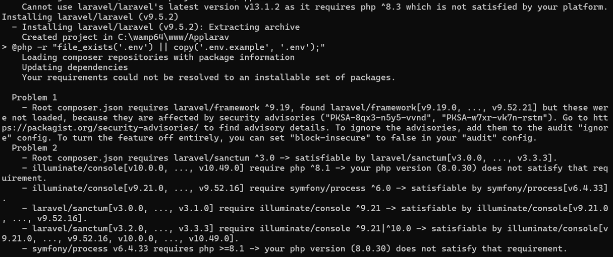
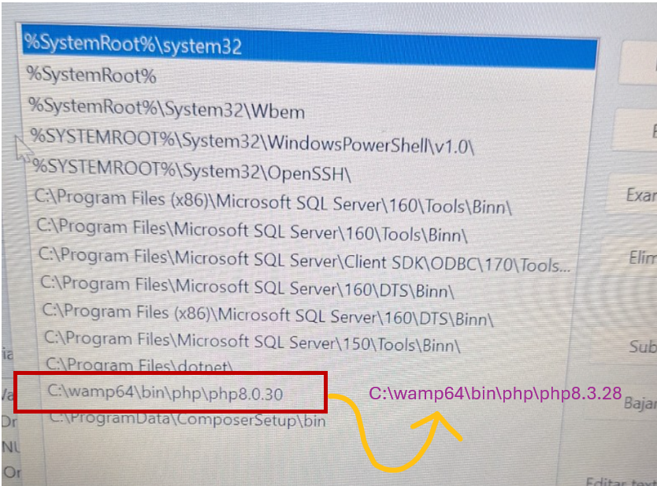
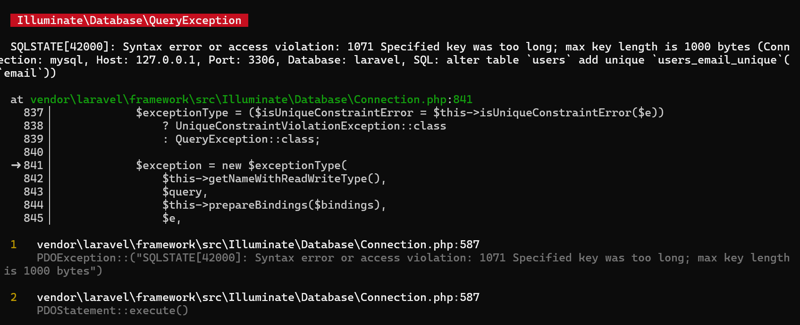
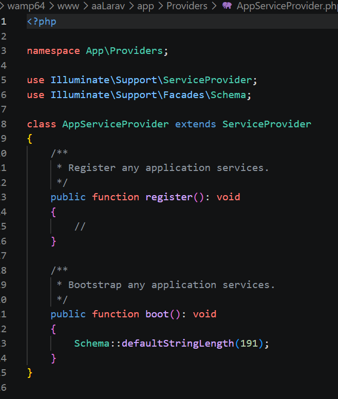
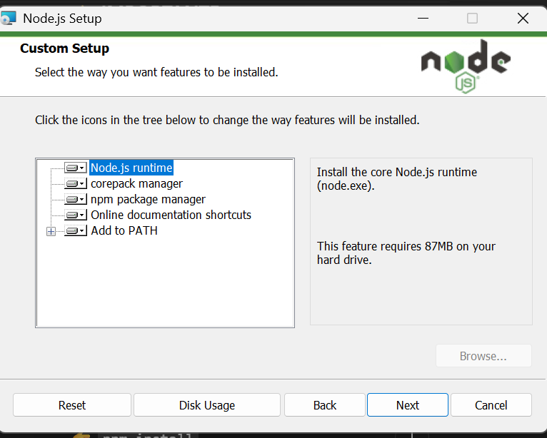

# Errores-en-la-Instalacion
## ⚠️ Errores encontrados y soluciones

---

### ❌ Error 1: Conflicto con versión de PHP

**Mensaje del error:**

No era un error como tall, el problema era que instalaba una versión de Laravel mas antiguo.
Mi WAMP decia PHP 8.3.28

**🧠 ¿Qué significa?**
El sistema estaba utilizando una versión antigua de PHP configurada en el PATH, lo que causaba incompatibilidad con Laravel moderno.

**🔧 Solución:**
Se actualizó el PATH del sistema para apuntar a la versión correcta de PHP (8.3) instalada en WampServer.


---
### ❌ Error 2: Base de datos no encontrada

**Mensaje del error:**

```bash
C:\wamp64\www\aaLarav>php artisan migrate

   WARN  The database 'laravel' does not exist on the 'mysql' connection.

  Would you like to create it? (yes/no) [yes]
```

**🧠 ¿Qué significa?**
Laravel intentó conectarse a una base de datos que no había sido creada previamente.

**🔧 Solución:**
Se permitió que Laravel creara automáticamente la base de datos en phpMyAdmin.

---

### ❌ Error 3: Error en migraciones (clave muy larga)

**Mensaje del error:**



**🧠 ¿Qué significa?**
Este error ocurre debido a limitaciones de MySQL al crear índices en campos tipo string con longitud grande.

**🔧 Solución:**
Este fue bastante facil de solucionar ya que estaba dentro del ppt "errores tipicos en la instalación", entonces
solo se modificó el archivo "AppServiceProvider.php" agregando:

```php
Schema::defaultStringLength(191);
```


---

### ❌ Error 4: npm no reconocido

**Mensaje del error:**

```bash
C:\wamp64\www\aaLarav>npm install
"npm" no se reconoce como un comando interno o externo,
programa o archivo por lotes ejecutable.
```

**🧠 ¿Qué significa?**
Este error indica que Node.js no estaba instalado o no estaba configurado en el PATH del sistema, por lo que el sistema no reconocía el comando npm.

**🔧 Solución:**
Se instaló Node.js desde su página oficial y se reinició la terminal.



Luego se verificó con:

```bash
C:\Users\KATLHYN>node -v
v24.14.1

C:\Users\KATLHYN>npm -v
11.11.0

C:\Users\KATLHYN>

```
Luego de eso pude ejecutar correctamente npm install

---
👤 Información del Estudiante

Este laboratorio ha sido desarrollado por el estudiante de la Universidad Tecnológica de Panamá:

Nombre: Kathlyn Morales
Correo: Kathlyn.Morales@utp.ac.pa
Curso: Desarrollo de Software VII
Instructor del Laboratorio: Irina Fong


